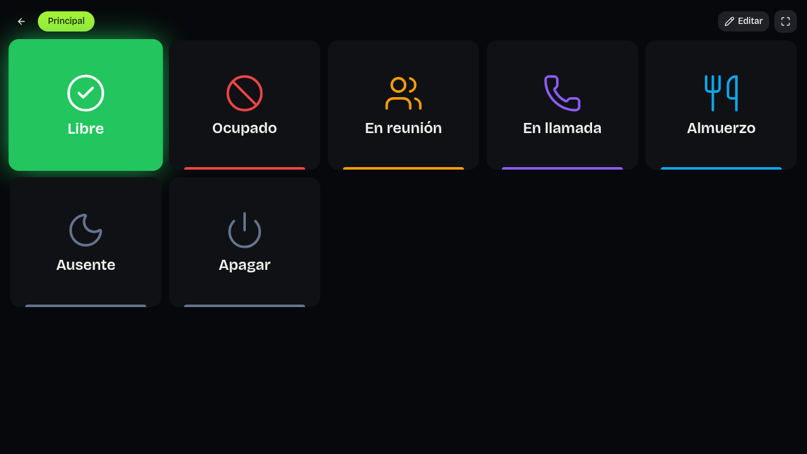
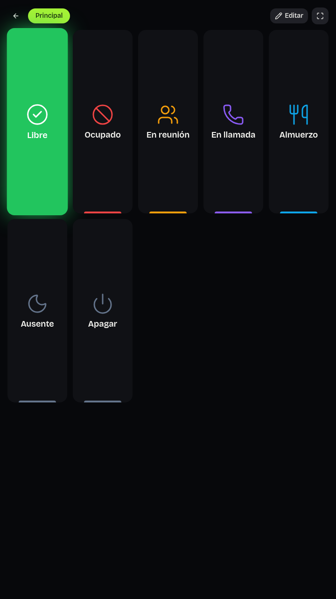
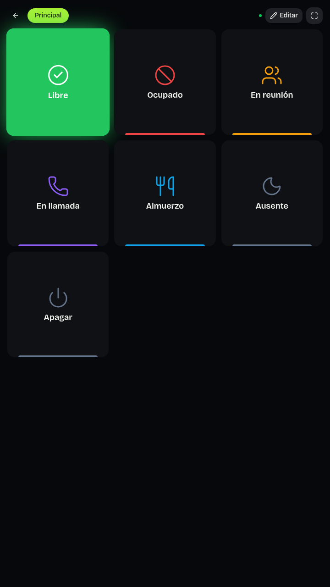

# Validación de VISO Deck Android

El material de referencia es el código de `2a515f5dd564bad5a939f10643d69757137c1a7b`, anterior a la rama Android. La auditoría del ZIP y las coincidencias de los componentes originales están en [android-audit.md](android-audit.md). La comparación usa los mismos datos y la misma cuenta de prueba de un backend Convex local; no crea ni modifica cuentas de producción.

La implementación permanece en `feature/viso-deck-android` y en el [PR #1, en borrador](https://github.com/elkauce/visoapparg/pull/1). Las comprobaciones siguientes corresponden al 9 de octubre de 2026; no implican una modificación de `main` ni del backend de producción.

## Referencia visual

Estas capturas pertenecen a la interfaz original, a 1280 × 720 y 720 × 1280. Se cargaron mediante el botón original «Cargar estados básicos» y se activó «Libre». Las siete teclas ocupadas conservan el orden original: Libre, Ocupado, En reunión, En llamada, Almuerzo, Ausente y Apagar. El resto de las quince posiciones permanece vacío.





Los colores de los estados se toman del código original y no se sustituyen por una paleta nueva. La comparación también registra los colores calculados, el brillo, el radio de las teclas y la fuente realmente renderizada, además del número de píxeles que cambian. Una adaptación de la cuadrícula a vertical puede cambiar la colocación sin modificar esos rasgos.

La versión web de la rama Android conserva las siete teclas, sus etiquetas, colores, brillo y radio. El [reporte de comparación](android-evidence/deck-visual-comparison.json) confirma `originalKeyAppearancePreserved: true`. En horizontal cambian 16 de 921.600 píxeles (aproximadamente 0,0017 %); en vertical cambian 59.693 (6,48 %), por la adaptación de la cuadrícula. Estas son capturas de Chromium y no del WebView Android.




La fuente efectivamente renderizada es Bricolage Grotesque en ambas versiones. Las cuatro fuentes WOFF2 de Bricolage Grotesque y Geist Mono están incluidas en los recursos de la aplicación. El [reporte offline](android-evidence/font-offline-report.json) confirma su carga y renderizado con todas las solicitudes remotas bloqueadas. Esta comprobación acredita los recursos tipográficos sin conexión, no el funcionamiento completo del Deck offline.

También se abrió la portada de [la web original](https://visoapparg.vercel.app/) en Chromium, con validación TLS, sin modificar datos ni registrar usuarios: renderizó sin errores JavaScript. La [captura de esa comprobación](android-evidence/production-readonly.png) acredita la portada pública, no una sesión autenticada ni su conexión con la APK.

## Reproducción local

El proceso necesita el backend local configurado para email/contraseña y Chromium. Los paquetes de la herramienta de navegador se instalan en un directorio auxiliar, fuera del repositorio:

```sh
mkdir -p /workspace/.visoapparg-setup/android-validation/browser-tools
cd /workspace/.visoapparg-setup/android-validation/browser-tools
npm install --ignore-scripts --no-audit --no-fund \
  --cache /workspace/.visoapparg-setup/npm-cache \
  playwright@1.55.1 pngjs@7.0.0 pixelmatch@6.0.0
```

Se extrae la referencia con `git archive`, sin cambiar de rama ni crear un worktree. Se sirve en un puerto distinto al de la rama actual. Ambas configuraciones deben usar exclusivamente `http://127.0.0.1:3210` como URL Convex y `http://127.0.0.1:3211` como URL HTTP de Convex.

```sh
node scripts/android-validation/capture-deck.mjs http://127.0.0.1:5175 original
node scripts/android-validation/capture-deck.mjs http://127.0.0.1:5176 android-web
node scripts/android-validation/compare-deck.mjs
```

El script rechaza frontends que no sean de loopback y bloquea peticiones a los dominios de Convex en la nube. Genera una cuenta de prueba local, guarda sus credenciales y el estado del navegador con permisos `0600` en el directorio auxiliar y no los imprime ni los añade a Git.

## Estado de las comprobaciones

| Comprobación | Evidencia actual |
| --- | --- |
| Referencia extraída sin modificar `main` | `git archive` de `2a515f5` fuera del repositorio |
| TypeScript y ESLint | Comprobaciones completadas sin errores |
| Pruebas automatizadas de backend y frontend | 139 pruebas aprobadas en 12 archivos con Vitest |
| Política de seguridad nativa | Cinco pruebas JVM de `NativePolicyTest` aprobadas: URL, paquetes autorizados, claves de almacenamiento y parámetros de Home Assistant/RGB |
| Registro e inicio de sesión propios | Confirmados contra el backend local y el despliegue de desarrollo `vivid-nightingale-785` |
| Teclas y estado activo de referencia | Capturas originales y reporte del navegador |
| Comparación visual de la rama Android | Completada en Chromium; siete teclas y apariencia original preservadas |
| Fuentes incluidas sin conexión | WOFF2 cargadas y renderizadas sin solicitudes remotas |
| Portada web de producción | Renderizado en Chromium sin errores JavaScript, comprobación de solo lectura |
| Compilación y firma del APK | `assembleDebug` completado; firma APK v2 verificada con `apksigner` |
| Instalación del APK en emulador | Instalación inicial comprobada con `pm path com.viso.deck`; el arranque de la app no quedó verificado |
| Almacenamiento cifrado en dispositivo | Dos pruebas instrumentadas de `SecureVaultInstrumentedTest` preparadas, todavía sin ejecutar |
| Retrato, paisaje y persistencia de sesión | Pendiente de ejecución del APK |
| Cambio de estado remoto | Alta, estados originales, preparación del Deck y confirmación de una activación verificados en el backend de desarrollo |
| Sincronización de Deck y Display entre dos sesiones | Dos contextos de navegador independientes en la web completa publicada: Deck → Display y panel web → Display, nombre y color en tiempo real, sin login en Display y persistencia tras recargar; cero errores JavaScript |
| Sincronización entre APK física y Display | Backend y cuenta compartidos configurados; falta verificar el flujo completo en el dispositivo físico |
| Deck offline y reconexión | Pendiente de ejecución del APK |
| Google Home, reproducción de otra app y luces físicas | Requieren configuración externa y dispositivos reales; no se presentan como verificadas |

El emulador disponible es x86_64, Android API 36 con Google APIs, con TCG y SwiftShader. Este entorno carece de `/dev/kvm`. Tras la instalación inicial, el watchdog del sistema terminó `system_server` durante la finalización de `ApkAssets`; la sesión de Android quedó inestable antes de completar la prueba de la aplicación. Ese fallo del emulador impide presentar como aprobados el inicio, la sesión persistente, la orientación y las pruebas instrumentadas. Compilar, firmar o instalar el APK no demuestra esos comportamientos.

La APK y la web completa compatible usan el mismo despliegue de desarrollo; sus cuentas son independientes de las de la web original. La prueba de dos contextos autenticó una cuenta de prueba existente en el panel web, abrió su Display público en un contexto sin sesión y comprobó Ocupado/rojo y Libre/verde sin recargar. También cambió el estado desde el panel principal y recargó el Display para comprobar persistencia. El [reporte publicado](android-evidence/cloud-sync-report.json) contiene los resultados sin credenciales ni enlaces de usuario. Véase [android-backend.md](android-backend.md) para las URL y la separación de entornos. La evidencia de navegador o emulador no sustituye la validación de hardware, cuentas OAuth ni permisos de aplicaciones de terceros en un dispositivo físico.
